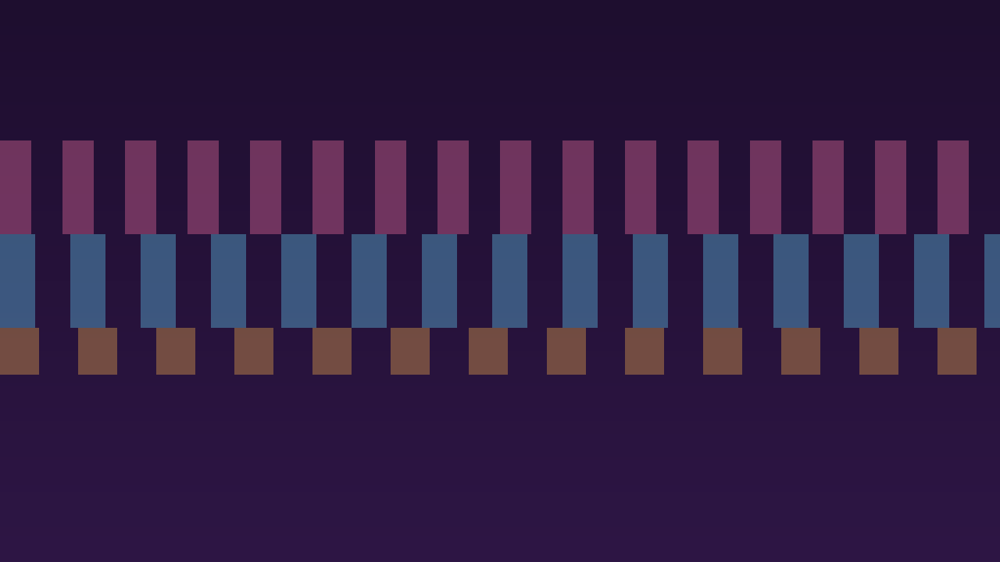

# Cassis Noir color theme 🍇

Step into a workspace that feels both stylish and comfortable with Cassis Noir! Deep purples create a soothing backdrop, while playful accent colors add a splash of energy to your coding sessions. Whether you’re working late or just want a theme that’s easy on the eyes, Cassis Noir brings elegance and personality to every line of code.



## Features
- Rich UI styling across the workbench, terminal, and built-in panels
- Carefully tuned contrast for readability without sacrificing atmosphere
- Expanded semantic and TextMate token coverage for modern languages (Python `self`, bracket pairs, Markdown, diffs, etc.)
- Program elements in the same category share close hues while staying distinguishable (variables in purple, constants in blue-purple; strings in faded orange, numbers in faded yellow)
- Rainbow bracket highlighting colors adjacent pairs with clearly different hues to make nested structures easy to follow
- Harmonized terminal ANSI palette that mirrors the editor colors while staying easy on the eyes


## Color Palette

| Role | Hex |
| --- | --- |
| Editor Background | `#1B0030` |
| Sidebar Background | `#200437` |
| Panel Background | `#1D0033` |
| Activity Bar Background | `#160126` |
| Status Bar Background | `#300055` |
| Title Bar Background | `#1D0431` |
| Activity Bar Badge | `#FF77AA` |
| Terminal Blue | `#62BEE6` |
| Terminal Cyan | `#58C3C3` |
| Storage Type | `#ee986e` |

## Installation

### From the Marketplace
1. Launch VS Code and open the Extensions view (`⇧⌘X` / `Ctrl+Shift+X`).
2. Search for **Cassis Noir**.
3. Click **Install**, then select the theme from the Color Theme picker (`⌘K ⌘T` / `Ctrl+K Ctrl+T`).

### Manual Install (VSIX)
1. Clone or download this repository.
2. Run `npm install` followed by `npm run package` to produce a `.vsix` bundle in the project root.
3. In VS Code, open the command palette (`⇧⌘P` / `Ctrl+Shift+P`) and select `Extensions: Install from VSIX...`.
4. Pick the generated `cassis-noir-theme-*.vsix` file.

## Development

```bash
npm install
npm run package   # creates a VSIX using vsce
npm run publish   # publishes to the Visual Studio Marketplace (requires PAT)
npm run ovsx:publish  # publishes to Open VSX (requires token)
```

Before publishing a new version, update `CHANGELOG.md`, bump the version in `package.json`, and tag the release in git.

### Live Preview While Editing

1. Open this folder in VS Code and press `F5` to launch the Extension Development Host.
2. Pick **Cassis Noir** in the host window via the Color Theme picker.
3. Tweak `themes/color-theme.json` in your main window and run `Developer: Reload Window` inside the host to see changes instantly.
4. Use `Developer: Inspect Editor Tokens and Scopes` to confirm which token scope is responsible for any color you want to adjust.

## Contributing

Have suggestions or see something missing? [Open an issue](https://github.com/aquarete/cassis-noir-theme/issues) or submit a pull request. Palette tweaks, additional language scopes, and screenshots in the theme are especially welcome.

## License

Released under the [MIT License](LICENSE).
