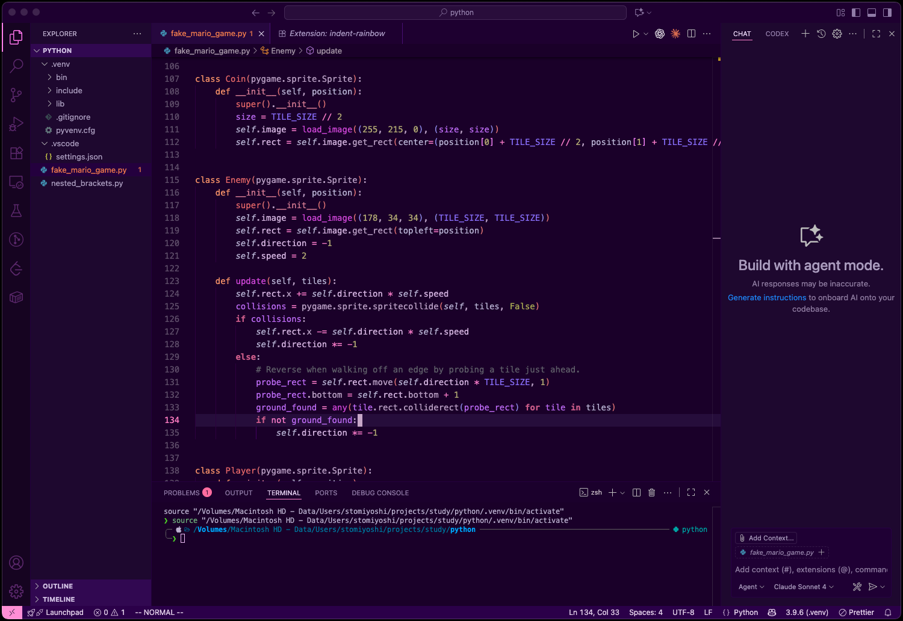

# Dark Purple Candy 🍭

A VS Code theme that blends deep midnight purples with candy-colored syntax highlights. Designed to be vivid enough for late-night sessions while staying easy on the eyes.



## Features
- Rich UI styling across the workbench, terminal, and built-in panels
- Carefully tuned contrast for readability without sacrificing atmosphere
- Expanded semantic and TextMate token coverage for modern languages (Python `self`, bracket pairs, Markdown, diffs, etc.)
- Harmonized terminal ANSI palette that mirrors the editor colors while staying easy on the eyes
- Purpose-built assets (icon, screenshot) with publish-ready metadata and scripts

## Color Palette

| Role | Hex |
| --- | --- |
| Core Background | `#1B0030` |
| Sidebar/Panel | `#270542` |
| Accent Pink | `#FF77AA` |
| Candy Blue | `#62BEE6` |
| Cotton-Candy Teal | `#58C3C3` |
| Honey Orange | `#ECAF68` |

## Installation

### From the Marketplace
1. Launch VS Code and open the Extensions view (`⇧⌘X` / `Ctrl+Shift+X`).
2. Search for **Dark Purple Candy**.
3. Click **Install**, then select the theme from the Color Theme picker (`⌘K ⌘T` / `Ctrl+K Ctrl+T`).

### Manual Install (VSIX)
1. Clone or download this repository.
2. Run `npm install` followed by `npm run package` to produce a `.vsix` bundle in the project root.
3. In VS Code, open the command palette (`⇧⌘P` / `Ctrl+Shift+P`) and select `Extensions: Install from VSIX...`.
4. Pick the generated `dark-purple-candy-theme-*.vsix` file.

## Development

```bash
npm install
npm run package   # creates a VSIX using vsce
npm run publish   # publishes to the Visual Studio Marketplace (requires PAT)
npm run ovsx:publish  # publishes to Open VSX (requires token)
```

Before publishing a new version, update `CHANGELOG.md`, bump the version in `package.json`, and tag the release in git.

### Live Preview While Editing

1. Open this folder in VS Code and press `F5` to launch the Extension Development Host.
2. Pick **Dark Purple Candy** in the host window via the Color Theme picker.
3. Tweak `themes/color-theme.json` in your main window and run `Developer: Reload Window` inside the host to see changes instantly.
4. Use `Developer: Inspect Editor Tokens and Scopes` to confirm which token scope is responsible for any color you want to adjust.

## Contributing

Have suggestions or see something missing? [Open an issue](https://github.com/aquarete/dark-purple-candy-theme/issues) or submit a pull request. Palette tweaks, additional language scopes, and screenshots in the theme are especially welcome.

## License

Released under the [MIT License](LICENSE).
